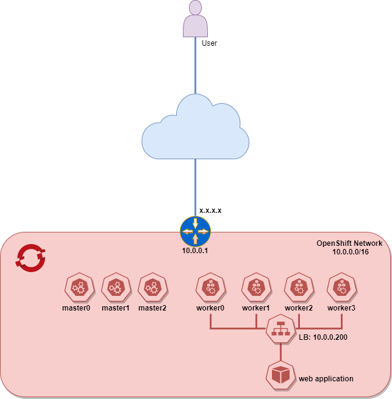

# Metallb deployment using Kustomize and demo how to use 

## Benefits of Metallb
Most of cloud providers providing load balancing service and Kubernetes vendors are using cloud provided load balancing 
services. What if deploying Kubernetes clusters on premises specially on BareMetal?
What kind of options we have?

1. Deploy hardware load balance appliances like F5, A10 or any other which meets requirements. They are too expencive,
additional space in network rack etc. Most important keep specialized engineering team to configure and later support them.

2. Deploy additional hardware server, install Linux flavor with HAPROXY. To use in production Linux hardening required as 
well as HAPROXY hardening.

Lots of activities needed just to have load balancing service deployed on BareMetal to allow users access their microservices
from outside.

Solution will be that Kubernetes cluster itself will provide Load Balancing, and Metallb project is for that purpose.

## Metallb demonstration topology



Node list:
```bash
   $ oc version
   Client Version: 4.7.3
   Server Version: 4.7.3
   Kubernetes Version: v1.20.0+bafe72f

   $ oc get nodes
   NAME                        STATUS   ROLES    AGE   VERSION
   cl01-pmrqc-master-0         Ready    master   48d   v1.20.0+551f7b2
   cl01-pmrqc-master-1         Ready    master   48d   v1.20.0+551f7b2
   cl01-pmrqc-master-2         Ready    master   48d   v1.20.0+551f7b2
   cl01-pmrqc-worker-0-2hdgg   Ready    worker   48d   v1.20.0+551f7b2
   cl01-pmrqc-worker-0-7q45l   Ready    worker   23h   v1.20.0+551f7b2
   cl01-pmrqc-worker-0-9q28r   Ready    worker   48d   v1.20.0+551f7b2
   cl01-pmrqc-worker-0-g8td2   Ready    worker   48d   v1.20.0+551f7b2
```
## Metallb demonstration deployment using kustomize (demonstrated on OpenShift)
Demo contains prepared Kustomize structure and all required steps. Only customize data to meet particular cluster requirements
and deploy.

```
.
|-- config
| |-- secretkey  --> literal secret key for metallb members
|-- kustomization.yml  --> combines all necessary resources, patches, secret generator etc. 
|-- metallb-clusterrole.yml  --> cluster role manifest necessary for metallb
|-- metallb-cm.yml  --> configuration of metallb
|-- metallb-rolebinding.yml  --> cluster role binding manifest necessary for metallb
```

## Metallb deployment
Prerequisite:
1. Logged in via oc or kubectl
2. Logged in with admin user
3. clone repo and modify to meet your cluster requirement
4. Run below command
```bash
   $ !Let assume we are in clone folder run below command
   $ kustomize build | oc apply -f -
   $ !if in different place than, lets assume cloned folder locates in your $HOME
   $ kustomize build ~/metallb | oc apply -f -
```
5. Results
```bash
   $ oc get all -n metallb-system
   NAME                             READY   STATUS    RESTARTS   AGE
   pod/controller-fccccff45-cljbc   1/1     Running   0          17h
   pod/speaker-dd86n                1/1     Running   0          17h
   pod/speaker-dkz8j                1/1     Running   0          17h
   pod/speaker-h75vz                1/1     Running   0          17h
   pod/speaker-nr2zd                1/1     Running   0          17h
   pod/speaker-s9s7g                1/1     Running   0          17h
   pod/speaker-v8mhl                1/1     Running   0          17h
   pod/speaker-x8bjl                1/1     Running   0          17h
   
   NAME                     DESIRED   CURRENT   READY   UP-TO-DATE   AVAILABLE   NODE SELECTOR            AGE
   daemonset.apps/speaker   7         7         7       7            7           kubernetes.io/os=linux   23h
   
   NAME                         READY   UP-TO-DATE   AVAILABLE   AGE
   deployment.apps/controller   1/1     1            1           23h
   
   NAME                                   DESIRED   CURRENT   READY   AGE
   replicaset.apps/controller-fccccff45   1         1         1       23h
   
   $ oc get cm -n metallb-system
   NAME               DATA   AGE
   config             1      23h
```
## Metallb demonstration on small test application
1. Deploy Hello OpenShift app, it small and fast to demonstrate
   ```bash
      $ !if you don't have project yet, create it first
      $ oc new-project app-test-metallb
      $ oc new-app openshift/hello-openshift
   ```
2. Now time to deploy service manifest for hello-openshift app
   ```bash
      cat <<EOF | oc apply -f -
      apiVersion: v1
      kind: Service
      metadata:
        name: hello-openshift-metallb
      spec:
        externalTrafficPolicy: Cluster
        ports:
        - name: http
          port: 80
          protocol: TCP
          targetPort: 8080
        selector:
          deployment: hello-openshift
        sessionAffinity: None
        type: LoadBalancer
      EOF
   ```
   As you guess type: LoadBalancer, makes possible to IP provided by Metallb controller
3. Result
   ```bash
      $ oc describe service hello-openshift-metallb
      Name:                     hello-openshift-metallb
      Namespace:                app-test-metallb
      Labels:                   <none>
      Annotations:              <none>
      Selector:                 deployment=hello-openshift
      Type:                     LoadBalancer
      IP Families:              <none>
      IP:                       172.30.177.148
      IPs:                      172.30.177.148
      LoadBalancer Ingress:     10.0.0.200
      Port:                     http  80/TCP
      TargetPort:               8080/TCP
      NodePort:                 http  31486/TCP
      Endpoints:                10.131.0.27:8080
      Session Affinity:         None
      External Traffic Policy:  Cluster
      Events:
        Type    Reason        Age   From             Message
        ----    ------        ----  ----             -------
        Normal  nodeAssigned  129m  metallb-speaker  announcing from node "cl01-pmrqc-worker-0-2hdgg"
   ```
   As you see metallb-speaker announcing
4. Trying to access app using LoadBalancer Ingress IP
   ```bash
      $ curl 10.0.0.200
      Hello OpenShift!
   ```
   Works!

> Note:
> In this demo I used L2 mode of metallb functionality, which has lots of limitations like:
> 1. LoadBalancer Ingress IP after assignment, only assigned node is handling for that IP and all flows pointed to that
>VIP will be passed through that node, even app will be located on different node
>2. Convergence is slow because it relies on Kubernetes cluster ( which will take about 5-10 min), using node-problem-detector Daemonset

## Metallb L3 mode
Coming soon demo